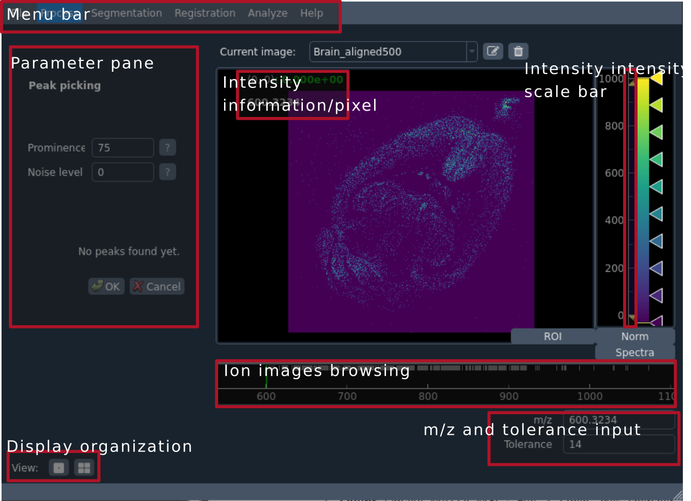

==========================
 Graphical user interface
==========================

Running the GUI
===============

In the Esmraldi folder, run the following command line::

     python -m gui.Esmraldi

A new window should open, which is organized like this:

* A central view that can display images. Move the cursor over to obtain intensity values at each pixel. Zoom in the image with the mouse wheel.
* A bar beneath the image display which allows to browse through ion images.
* A scale bar, on the right, which allows to adjust the contrast
* Input text fields to select a specific m/z and the tolerance
* A menu bar where various functions can be called (peak picking and alignment, registration, basic segmentation...)
* A window pane on the left which updates depending on the function called in the menu bar
* Buttons to add a supplementary view (useful to compare two images). The keyboard shortcut "Ctrl+L" allows to link the two views (useful to inspect registration).
* Buttons to display a region of interest (ROI), mean spectra (Spectra), and normalization options (Norm).

The mean spectra can be browsed by zooming on the m/z axis with the wheel. Move the m/z axis right or left, by dragging with the middle button of your mouse pressed. A peak in the spectrum can be selected by dragging with the left button of the mouse pressed. The intensity axis can be adjusted by dragging with the right button of the mouse pressed.

Opening and saving files
========================

Files can be opened and saved in the "File" menu. Accepted formats are imzML, tif, and most common image formats (jpg, png...).
When you save an image, always specify the filename as well as the extension (.tif, .imzML...)

Process
=======

Peak picking can be done by calling "Process > Peak picking - mean spectrum". The prominence parameter is a threshold above which the peaks in the mean spectra are kept. Specify the tolerance in ppm, and click "OK".
After computation, inspect the peaks by browsing the mean spectra. Select a few ions where the peaks are picked, especially those in low signal, to see if noise is picked up. If it is, try and increase the prominence value in order to obtain fewer peaks, until only relevant peaks are kept.

You can import peaks from the output annotation file from Metaspace by going to "Process > Metaspace peak import".

Then, peaks can be realigned by calling "Process > Spectra alignment". Specify the tolerance and click "OK". You can then save the peak picked image as imzML or tif by going to "File > Save as".

Segmentation
============

This menu gives basic segmentation options.

* "Extract channels" expects the channel number and extract that image.
* "Thresholding" allows to select a low and high threshold to obtain a binary image. Thresholds are in percentages of the maximum intensities in the image.

"New mask" and "Add ROI to mask" are useful for quantification purposes and are meant to delineate areas in a mimetic tissue:

* "New mask" creates a blank image with the same size as the currently opened image.
* "Add ROI to mask" adds the currently delineated ROI (in the ROI menu) to the mask created from "New mask". Use this several times to create labelled regions for different conditions.

Registration
============

This menu allows to perform fiducial-based registration.

* "Fiducials - Selection" allows to select corresponding points in the images. Double click on each image to add a point. Each point number should match the number in the other image. Then, click "OK" to run the registration. Inspect the resulting registration by hitting "Ctrl+L" (linked views). Pixels in one image should match the other.
* "Fiducials - coordinates": not implemented.
