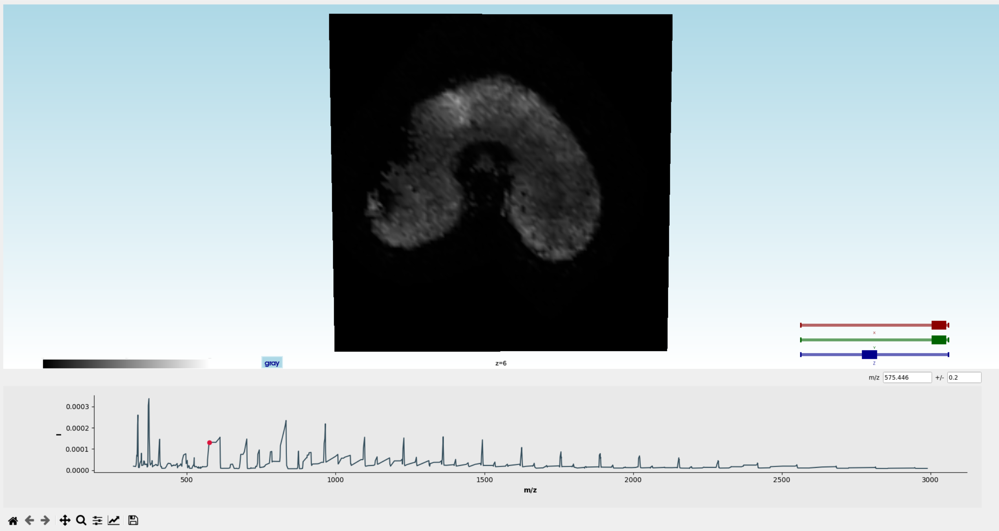
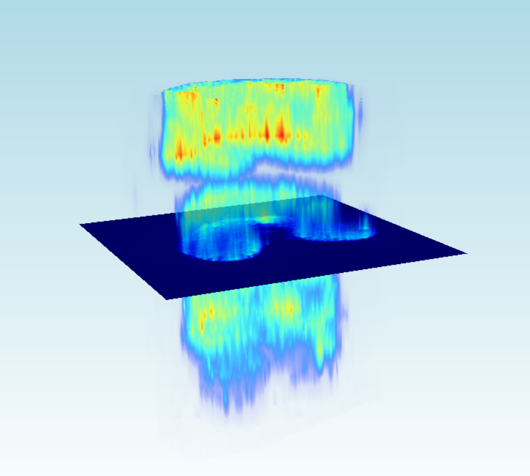

===========
3D workflow
===========

Esmraldi is suited for the joint statistical analysis of 3D MS images along with other imaging modalities.
The registration and statistical analysis steps should be adapted compared to the traditional 2D use-case. Refer to :doc:`Usage <./usage>` for this case.

Registration
============

Usually, 2D MS slices have different intensities. Thus, regular intensity-based metrics are not suited. We opt for metrics based on the **geometry of the objects**. The **distance transformation** maps each pixel to its distance to the border of the object. It is applied prior to the registration step on both the reference and target images.

Moreover, the orientations of the samples are usually very different for several 2D MS slices. As a result, it is difficult to choose appropriate registration parameters suited for the registration of all slices. We opt for an **exhaustive registration** approach, where the global optimum is selected over predefined rotation and scaling parameters.

It can be applied in the code directly by calling: ::

  python -m examples.registration --best_rotation -i INPUT -o OUTPUT

Followed by the variational registration step based on the distance transformed images.

Statistical analysis
====================

Statistical analysis can be done on the full 3D volume, or on **each 2D slice independently**. In cases of varying intensities between 2D MS slices, the latter approach should be preferred, by specifying this argument: ::

  python -m examples.statistical_analysis --split

Registration is done from the shape of the objects. After registration, the borders of both objects should be aligned. However, regions which are similar in terms of **intensity** might not be perfectly aligned.
We propose to use the output from the NMF (Non Negative Matrix Factorization). The register component images are registered by translation onto the reference image. The translation is activated by default during statistical analysis. If you would like to deactivate NMF component image translation, you can use the following argument: ::

  python -m examples.statistical_analysis --no_translation

Visualization
=============

At each step of the workflow, 3D MS images may be visualized. Our visualization tool allows for the visualization of **2D slices**, as well as a **rendering of the volume**.

The slices can be selected by the slider "z" on the right of the screen. One can select specific m/z, using the text box on the right of the screen, or by clicking on the average spectrum displayed below the image. All 2D slices can be shown at the same by hitting the **"z" key**. The 3D volume rendering can be shown by hitting the **"v" key**:

The visualization tool can be launched using: ::

  python3 -m examples.3D_viewer -i INPUT -s SPACING_SLICES --memmap

The ``spacing`` argument allows to set the distance between each 2D MS slices. It is expressed as the multiplicative ratio between the lateral resolution and spatial resolution. For instance, for a pixel size of 20x20, with an inter-slice parameter of 100, the ``spacing`` would be 100/20 = 5.

The ``memmap`` argument allows to map the file to disk, which allows for faster loading of the image in the subsequent usages. Warning: this option copies the image on the disk in a folder called "mmap". This might result in large disk usage.

